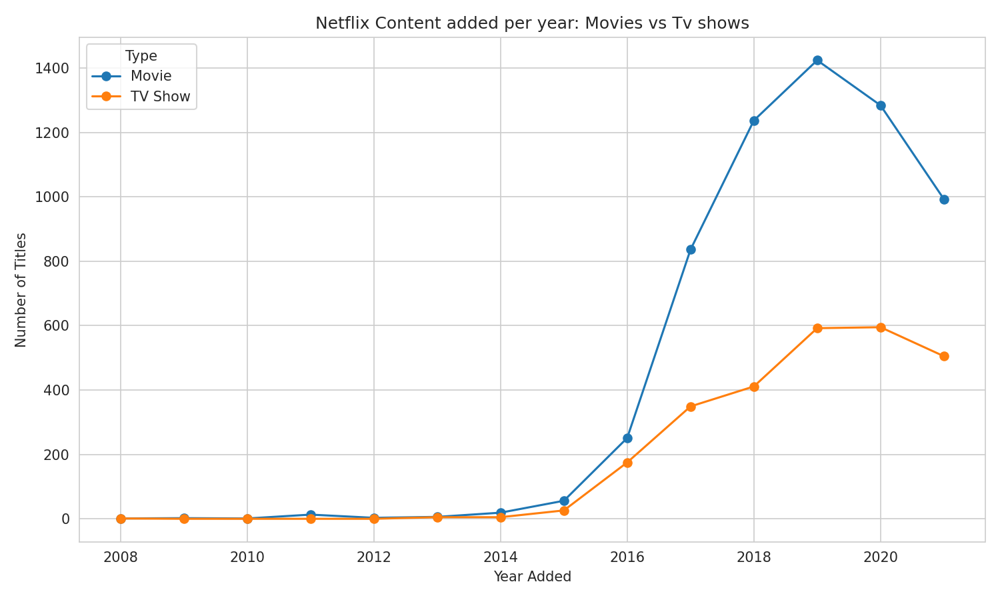
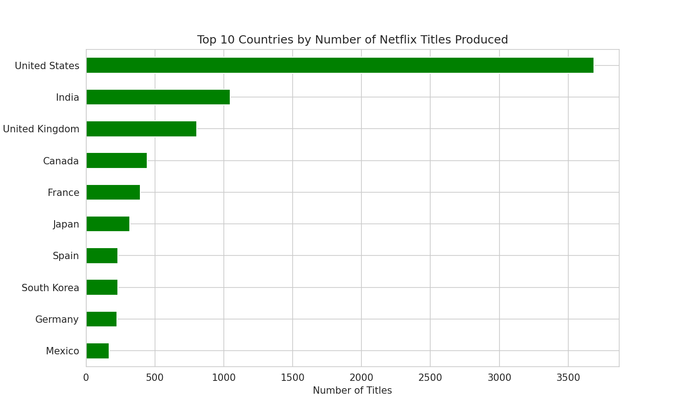
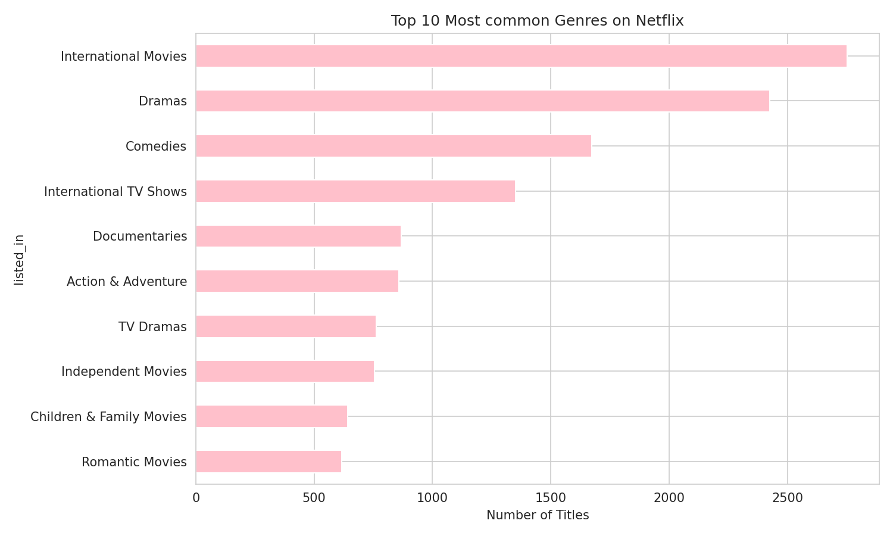
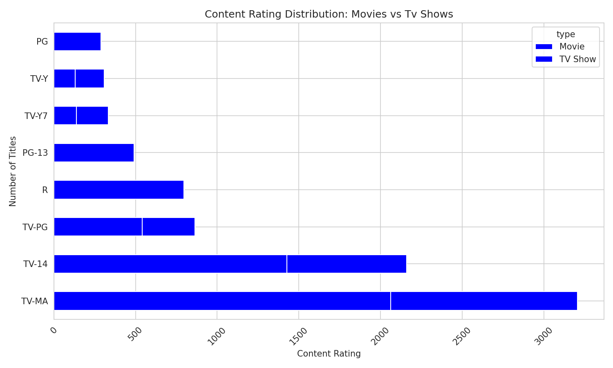
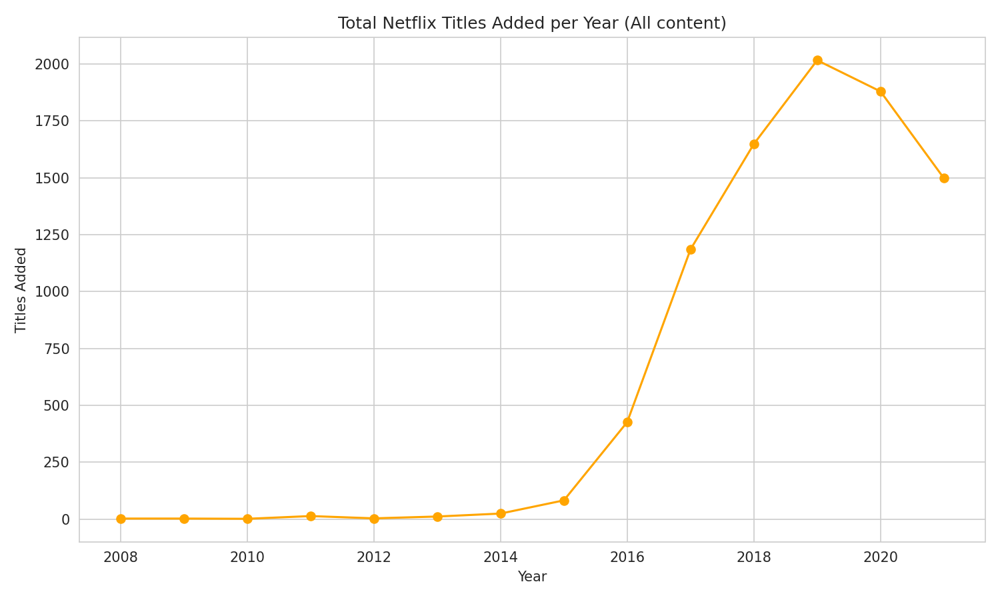

# Netflix Content Analysis

Exploratory data analysis of Netflix's global content catalog (~8,800 titles),
examining content growth over time, top-producing countries, genre trends,
and content rating patterns.

## Dataset

[Netflix Movies and TV Shows](https://www.kaggle.com/datasets/shivamb/netflix-shows)
— a real dataset of titles available on Netflix, including type, director,
cast, country, date added, release year, rating, duration, and genre.

The dataset is downloaded automatically via [`kagglehub`](https://github.com/Kaggle/kagglehub)
when the script runs — no manual download needed. This does require a free
Kaggle account with API credentials configured once on your machine:

1. Create a free account at [kaggle.com](https://www.kaggle.com) if you don't have one.
2. Go to **Account → Settings → API → Create New Token** — this downloads a `kaggle.json` file.
3. Place that file at `~/.kaggle/kaggle.json` (Mac/Linux) or `C:\Users\<you>\.kaggle\kaggle.json` (Windows).

After that one-time setup, `kagglehub` handles the download automatically every time the script runs.

## Tools Used

Python, Pandas, Matplotlib, Seaborn, kagglehub

## What This Project Does

- Downloads and cleans a real-world dataset with significant missing data and multi-value fields
- Answers 5 specific questions about Netflix's content catalog
- Produces 5 visualizations and a written summary of findings

## Key Insights

- Movies make up the large majority of the catalog, with TV Shows a smaller but significant share.
- The United States is the leading content-producing country in the dataset, followed by India and the United Kingdom.
- "International Movies," "Dramas," and "Comedies" are consistently among the most common genres.
- Netflix's catalog additions grew sharply between 2016 and 2019, then leveled off in more recent years.
- TV-MA and TV-14 are the most common content ratings, and skew noticeably differently between Movies and TV Shows.

*(Update these bullet points with your own exact numbers after running the script — see the printed "SUMMARY OF FINDINGS" section in your terminal output.)*

## Sample Output











## How to Run

```bash
pip install -r requirements.txt
python netflix_analysis.py
```

## Project Structure

```
├── netflix_analysis.py                       # main analysis script
├── requirements.txt                            # Python dependencies
├── Chart1_content_added_per_year.png
├── Chart2_top_countries.png
├── Chart3_top_genres.png
├── Chart4_rating_distribution.png
├── Chart5_catalog_growth.png
├── LICENSE
└── README.md
```

## Possible Next Steps

- Break down content growth by genre over time, not just overall
- Compare Netflix's catalog trends against a second streaming platform's public dataset
- Turn the cleaning + analysis steps into reusable functions for easier extension

## License

This project is licensed under the MIT License — see the [LICENSE](LICENSE) file for details.
